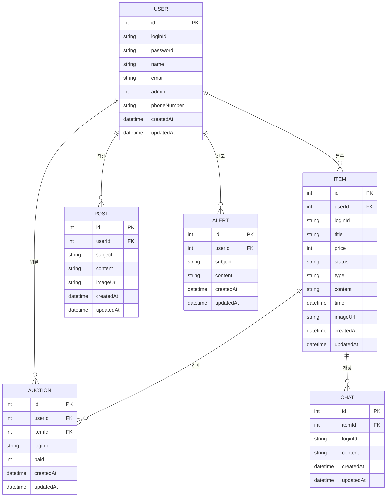
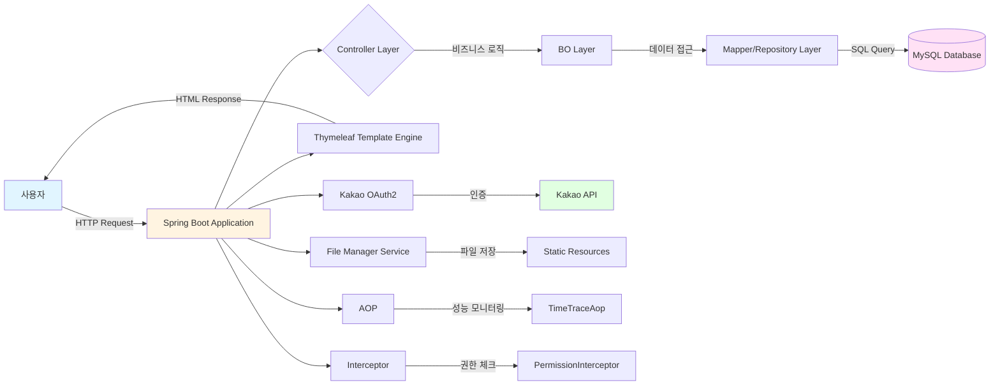
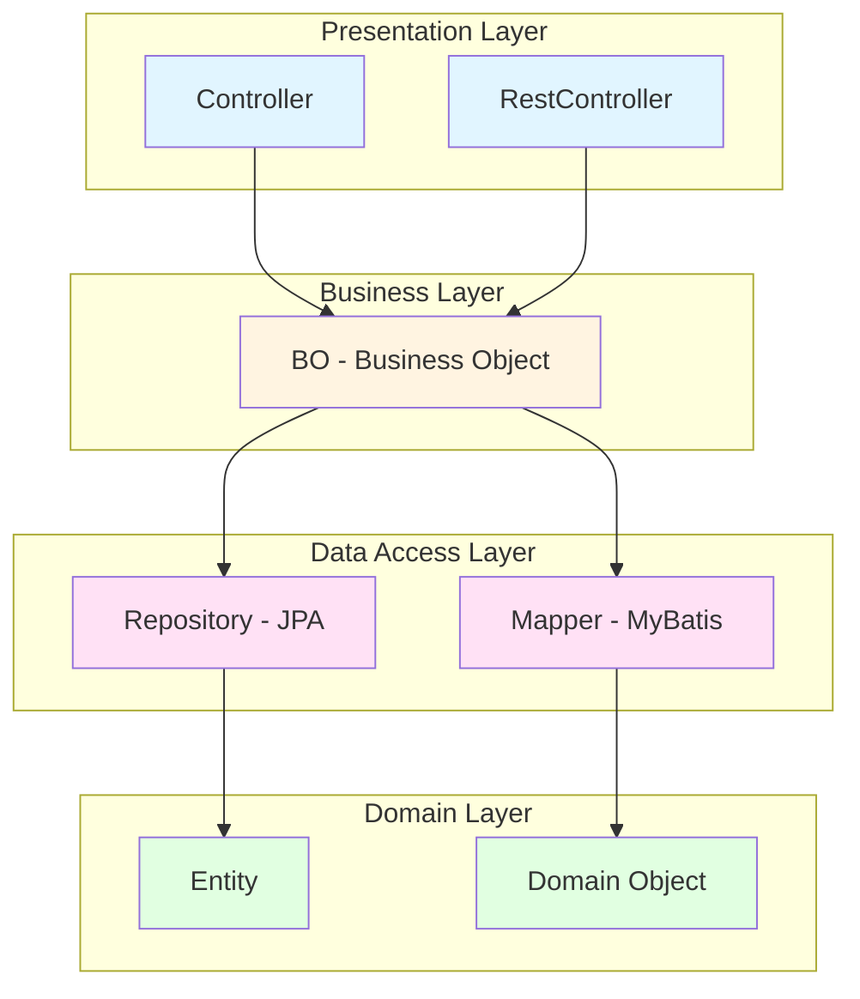
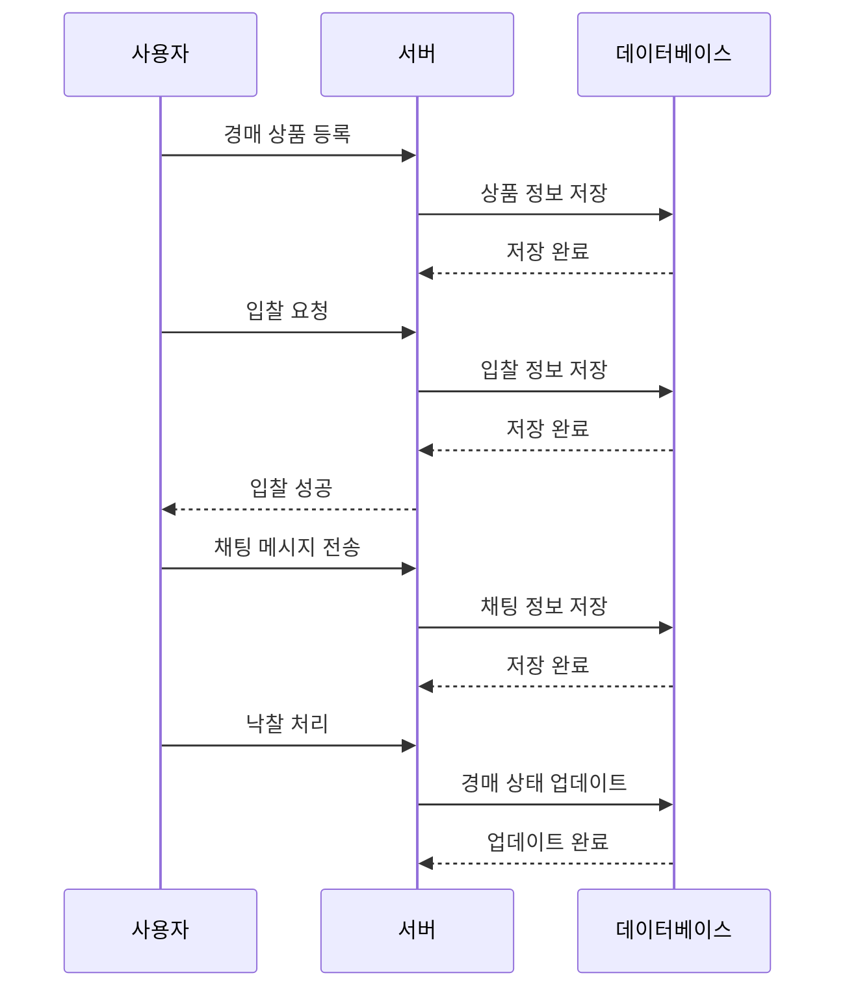

# ⌨️ Keyboard SBA

키보드 커뮤니티 및 중고거래 플랫폼입니다. 키보드, 키캡 등 다양한 기계식 키보드 관련 제품을 판매하고, 경매 시스템을 통해 거래할 수 있으며, 커뮤니티 게시판을 통해 정보를 공유할 수 있는 통합 플랫폼입니다.

## 📋 목차

- [주요 기능](#주요-기능)
- [기술 스택](#기술-스택)
- [프로젝트 구조](#프로젝트-구조)
- [데이터베이스 설계](#데이터베이스-설계)
- [시스템 아키텍처](#시스템-아키텍처)
- [설치 및 실행](#설치-및-실행)
- [주요 API 엔드포인트](#주요-api-엔드포인트)
- [기능 상세 설명](#기능-상세-설명)

## ✨ 주요 기능

### 🔐 사용자 관리
- 일반 회원가입 및 로그인
- 카카오 소셜 로그인 연동
- 사용자 프로필 관리
- 관리자 권한 관리

### 🛒 상품 관리
- 키보드, 키캡, 중고거래 상품 등록 및 관리
- 상품 상세 정보 조회
- 상품 수정 및 삭제
- 이미지 업로드 지원

### 🔨 경매 시스템
- 경매 참여 및 입찰
- 경매 상품 등록 및 관리
- 입찰 내역 조회
- 낙찰 처리

### 💬 채팅 시스템
- 경매 상품별 채팅 기능
- 채팅 메시지 작성 및 전송
- 채팅 내역 조회 (페이지 새로고침 필요)

### 📝 커뮤니티 게시판
- 게시글 작성, 수정, 삭제
- 게시글 목록 조회
- 이미지 첨부 지원

### 🚨 신고 시스템
- 부적절한 게시글/상품 신고 기능
- 신고 내용 작성 및 이미지 첨부
- 관리자 신고 목록 조회 및 처리

### 👨‍💼 관리자 기능
- 사용자 관리
- 게시글 관리
- 상품 관리
- 신고 관리

## 🛠 기술 스택

### Backend
- **Java 17** - 프로그래밍 언어
- **Spring Boot 3.3.2** - 웹 애플리케이션 프레임워크
- **Spring Data JPA** - 데이터베이스 ORM
- **MyBatis 3.0.3** - SQL 매퍼 프레임워크
- **MySQL** - 관계형 데이터베이스
- **Thymeleaf** - 서버 사이드 템플릿 엔진
- **Lombok** - 보일러플레이트 코드 제거
- **Spring WebFlux** - 비동기 웹 처리

### Build & Deploy
- **Gradle** - 빌드 도구
- **War** - 웹 애플리케이션 패키징

### Development Tools
- **p6spy** - SQL 로깅 및 모니터링
- **Spring Boot DevTools** - 개발 편의 도구

## 📁 프로젝트 구조

```mermaid
graph TB
    A[keyboardSBA] --> B[src/main/java/com/keyboardsba]
    B --> C[admin/]
    B --> D[alert/]
    B --> E[auction/]
    B --> F[chat/]
    B --> G[common/]
    B --> H[config/]
    B --> I[item/]
    B --> J[kakao/]
    B --> K[post/]
    B --> L[user/]
    B --> M[aop/]
    B --> N[Interceptor/]
    
    C --> C1[AdminController.java]
    C --> C2[AdminRestController.java]
    C --> C3[bo/AdminBO.java]
    
    D --> D1[AlertController.java]
    D --> D2[AlertRestController.java]
    D --> D3[bo/AlertBO.java]
    D --> D4[domain/Alert.java]
    D --> D5[mapper/AlertMapper.java]
    
    E --> E1[AuctionController.java]
    E --> E2[AuctionRestController.java]
    E --> E3[bo/AuctionBO.java]
    E --> E4[domain/Auction.java]
    E --> E5[mapper/AuctionMapper.java]
    
    F --> F1[ChatRestController.java]
    F --> F2[bo/ChatBO.java]
    F --> F3[domain/Chat.java]
    F --> F4[mapper/ChatMapper.java]
    
    G --> G1[EncryptUtils.java]
    G --> G2[FileManagerService.java]
    
    I --> I1[ItemController.java]
    I --> I2[ItemRestController.java]
    I --> I3[bo/ItemBO.java]
    I --> I4[domain/Item.java]
    I --> I5[mapper/ItemMapper.java]
    
    J --> J1[KakaoController.java]
    J --> J2[bo/KakaoBO.java]
    J --> J3[entity/KakaoTokenResponse.java]
    J --> J4[entity/KakaoUser.java]
    J --> J5[entity/User.java]
    J --> J6[repository/KakaoRepository.java]
    
    K --> K1[PostController.java]
    K --> K2[PostRestController.java]
    K --> K3[bo/PostBO.java]
    K --> K4[domain/Post.java]
    K --> K5[mapper/PostMapper.java]
    
    L --> L1[UserController.java]
    L --> L2[UserRestController.java]
    L --> L3[bo/UserBO.java]
    L --> L4[entity/UserEntity.java]
    L --> L5[repository/UserRepository.java]
    
    M --> M1[TimeTraceAop.java]
    N --> N1[PermissionInterceptor.java]
    
    style A fill:#e1f5ff
    style B fill:#fff4e1
    style C fill:#ffe1f5
    style D fill:#ffe1f5
    style E fill:#ffe1f5
    style F fill:#ffe1f5
    style G fill:#e1ffe1
    style I fill:#ffe1f5
    style J fill:#ffe1f5
    style K fill:#ffe1f5
    style L fill:#ffe1f5
```



### 디렉토리 구조

```
keyboardSBA/
├── src/
│   ├── main/
│   │   ├── java/com/keyboardsba/
│   │   │   ├── admin/          # 관리자 기능
│   │   │   ├── alert/          # 알림 기능
│   │   │   ├── auction/        # 경매 기능
│   │   │   ├── chat/           # 채팅 기능
│   │   │   ├── common/         # 공통 유틸리티
│   │   │   ├── config/         # 설정 파일
│   │   │   ├── item/           # 상품 관리
│   │   │   ├── kakao/          # 카카오 로그인
│   │   │   ├── post/           # 게시판
│   │   │   ├── user/           # 사용자 관리
│   │   │   ├── aop/            # AOP 설정
│   │   │   └── Interceptor/    # 인터셉터
│   │   └── resources/
│   │       ├── application.yml # 설정 파일
│   │       ├── mappers/        # MyBatis 매퍼 XML
│   │       ├── static/         # 정적 리소스
│   │       └── templates/      # Thymeleaf 템플릿
│   └── test/                   # 테스트 코드
├── build.gradle                # Gradle 빌드 설정
├── settings.gradle             # Gradle 프로젝트 설정
└── README.md                   # 프로젝트 문서
```

## 🗄 데이터베이스 설계



### 테이블 설명

#### USER (사용자)
- 사용자 정보를 저장하는 테이블
- 일반 회원가입 및 카카오 로그인 사용자 모두 포함
- `admin` 필드로 관리자 권한 관리

#### ITEM (상품)
- 판매 상품 정보를 저장하는 테이블
- `type` 필드로 키보드(keyboard), 키캡(keycap), 중고거래(trade), 경매(auction) 구분
- `status` 필드로 판매 상태 관리

#### POST (게시글)
- 커뮤니티 게시글 정보를 저장하는 테이블
- 이미지 첨부 지원

#### AUCTION (경매)
- 경매 입찰 정보를 저장하는 테이블
- `paid` 필드로 입찰 금액 관리

#### CHAT (채팅)
- 경매 상품별 채팅 메시지를 저장하는 테이블
- 상품별로 채팅방 구분

#### ALERT (신고)
- 사용자 신고 정보를 저장하는 테이블
- 부적절한 게시글, 상품 등에 대한 신고 내용 저장

## 🏗 시스템 아키텍처



### 레이어 구조



## 🚀 설치 및 실행

### 필수 요구사항
- Java 17 이상
- MySQL 8.0 이상
- Gradle 7.0 이상

### 설치 단계

1. **저장소 클론**
```bash
git clone https://github.com/your-username/keyboardSBA.git
cd keyboardSBA
```

2. **데이터베이스 설정**
   - MySQL 데이터베이스 생성
   ```sql
   CREATE DATABASE keyboard_sba CHARACTER SET utf8mb4 COLLATE utf8mb4_unicode_ci;
   ```
   - `src/main/resources/application.yml` 파일에서 데이터베이스 연결 정보 수정
   ```yaml
   spring:
     datasource:
       url: jdbc:mysql://localhost:3306/keyboard_sba?characterEncoding=UTF-8
       username: your_username
       password: your_password
   ```

3. **카카오 OAuth 설정** (선택사항)
   - 카카오 개발자 콘솔에서 애플리케이션 등록
   - `application.yml` 파일에서 카카오 OAuth 정보 수정
   ```yaml
   spring:
     security:
       oauth2:
         client:
           registration:
             kakao:
               client-id: your_client_id
               client-secret: your_client_secret
               redirect-uri: http://localhost:80/kakao/callback
   ```

4. **프로젝트 빌드**
```bash
# Windows
gradlew.bat build

# Linux/Mac
./gradlew build
```

5. **애플리케이션 실행**
```bash
# Windows
gradlew.bat bootRun

# Linux/Mac
./gradlew bootRun
```

6. **브라우저에서 접속**
   - http://localhost:80

### 개발 환경 설정

- IDE: IntelliJ IDEA 또는 Eclipse 권장
- Lombok 플러그인 설치 필수
- Spring Boot DevTools로 자동 재시작 활성화

## 📡 주요 API 엔드포인트

### 사용자 관련
```
GET  /user/sign-up-view          # 회원가입 페이지
GET  /user/sign-in-view          # 로그인 페이지
POST /user/sign-up               # 회원가입 처리
POST /user/sign-in               # 로그인 처리
GET  /user/sign-out              # 로그아웃
GET  /kakao/callback             # 카카오 로그인 콜백
```

### 상품 관련
```
GET  /item/item-list-view        # 상품 목록 페이지
GET  /item/item-keyboard-view    # 키보드 목록 페이지
GET  /item/item-keycap-view      # 키캡 목록 페이지
GET  /item/item-trade-view       # 중고거래 목록 페이지
GET  /item/item-create-view      # 상품 등록 페이지
GET  /item/item-detail-view      # 상품 상세 페이지
GET  /item/item-update-view      # 상품 수정 페이지
POST /item/create                # 상품 등록 처리
POST /item/update                # 상품 수정 처리
POST /item/delete                # 상품 삭제 처리
```

### 경매 관련
```
GET  /auction/auction-list-view  # 경매 목록 페이지
GET  /auction/auction-create-view # 경매 등록 페이지
GET  /auction/auction-detail-view # 경매 상세 페이지
GET  /auction/auction-update-view # 경매 수정 페이지
GET  /auction/chat               # 경매 채팅 페이지
GET  /auction/paid               # 낙찰 내역 페이지
POST /auction/create             # 경매 등록 처리
POST /auction/bid                # 입찰 처리
```

### 게시판 관련
```
GET  /post/post-list-view        # 게시글 목록 페이지
GET  /post/post-create-view      # 게시글 작성 페이지
GET  /post/post-detail-view      # 게시글 상세 페이지
POST /post/create                # 게시글 작성 처리
POST /post/update                # 게시글 수정 처리
POST /post/delete                # 게시글 삭제 처리
```

### 채팅 관련
```
GET  /chat/list                  # 채팅 목록 조회
POST /chat/create                # 채팅 메시지 전송
```

### 신고 관련
```
GET  /alert/alert-detail-view    # 신고 작성 페이지
POST /alert/create               # 신고 등록 처리
DELETE /alert/delete             # 신고 삭제 처리
```

### 관리자 관련
```
GET  /admin/admin-list-view      # 관리자 메인 페이지
GET  /admin/user                 # 사용자 관리 페이지
GET  /admin/post                 # 게시글 관리 페이지
GET  /admin/item                 # 상품 관리 페이지
GET  /admin/alert                # 신고 관리 페이지
```

## 📖 기능 상세 설명

### 1. 사용자 인증 시스템

#### 일반 회원가입/로그인
- 아이디, 비밀번호, 이름, 이메일, 전화번호를 통한 회원가입
- 비밀번호 암호화 저장 (EncryptUtils 사용)
- 세션 기반 인증 관리

#### 카카오 소셜 로그인
- OAuth 2.0 기반 카카오 로그인 연동
- 카카오 계정 정보를 통한 자동 회원가입
- 이메일 및 닉네임 정보 자동 수집

### 2. 상품 관리 시스템

#### 상품 분류
- **키보드 (keyboard)**: 기계식 키보드 판매
- **키캡 (keycap)**: 키캡 세트 판매
- **중고거래 (trade)**: 중고 상품 거래
- **경매 (auction)**: 경매 상품

#### 상품 기능
- 상품 등록 시 이미지 업로드 지원 (최대 5MB)
- 상품 수정 및 삭제 (판매자만 가능)
- 상품 상태 관리 (판매중, 판매완료 등)
- 가격 정보 관리

### 3. 경매 시스템

#### 경매 프로세스


#### 경매 기능
- 입찰 시스템
- 입찰 내역 조회
- 경매 상품별 채팅 기능
- 낙찰 처리 및 결제 정보 관리

### 4. 채팅 시스템
- 경매 상품별 독립적인 채팅방
- 채팅 메시지 작성 및 전송
- 채팅 내역 조회 (페이지 새로고침 시 최신 메시지 표시)
- 채팅 내역 저장 및 관리

### 5. 커뮤니티 게시판
- 게시글 작성, 수정, 삭제
- 이미지 첨부 지원
- 게시글 목록 조회 및 검색
- 작성자 정보 표시

### 6. 신고 시스템
- 부적절한 게시글, 상품 등에 대한 신고 기능
- 신고 내용 작성 및 이미지 첨부 지원
- 관리자 신고 목록 조회 및 삭제 처리
- 신고된 내용에 대한 관리자 검토 및 조치

### 7. 관리자 기능
- 사용자 관리 (조회, 권한 관리)
- 게시글 관리 (조회, 삭제)
- 상품 관리 (조회, 삭제)
- 알림 발송 및 관리

## 🔒 보안 기능

### 인터셉터 기반 권한 관리
- `PermissionInterceptor`를 통한 접근 권한 제어
- 관리자 페이지 접근 제한
- 로그인 필요 페이지 자동 리다이렉트

### AOP 기반 성능 모니터링
- `TimeTraceAop`를 통한 메서드 실행 시간 측정
- 성능 최적화를 위한 로깅

### 파일 업로드 보안
- 파일 크기 제한 (최대 5MB)
- 파일 타입 검증
- 안전한 파일 저장 경로 관리

## 🧪 테스트

```bash
# 전체 테스트 실행
./gradlew test

# 특정 테스트 클래스 실행
./gradlew test --tests KeyboardSbaApplicationTests
```

## 📝 라이선스

이 프로젝트는 개인 프로젝트입니다.

## 👥 기여자

- 프로젝트 개발자

## 📞 문의

프로젝트 관련 문의사항이 있으시면 이슈를 등록해주세요.

---

**Keyboard SBA** - 키보드 커뮤니티와 중고거래를 한 곳에서! ⌨️
